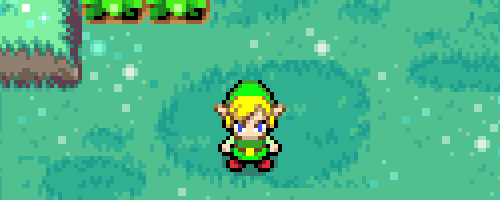
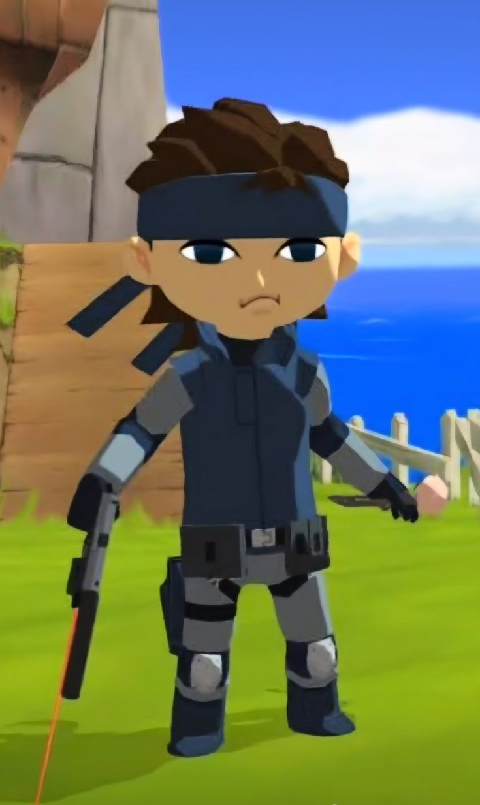
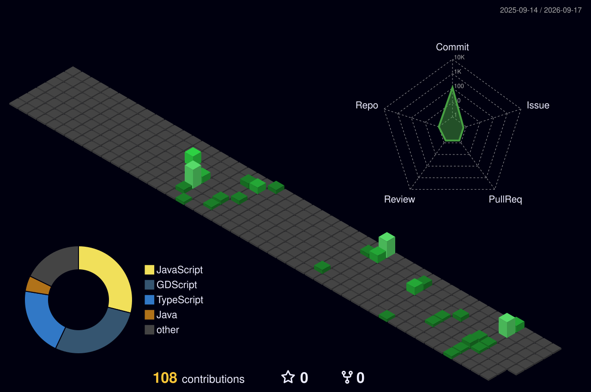

  

<h1 align="center">

</h1>

Desde que inicié en la programación, me he enfocado en construir experiencias de usuario (UX) intuitivas, fluidas y atractivas. Me gusta transformar el software a uno accesible y sencillo de usar, cuidando el visual y funcional para que la interacción sea natural.

combino el desarrollo de software con principios de diseño UI/UX, buscando que el codigo no sea tan espagueti xd, sino que realmente aporte valor y facilite la vida a las personas. Disfruto colaborar en proyectos donde la calidad técnica y la satisfacción del usuario van de la mano.

y bueno aprendiendo de los errores que llego a cometer

 

## contribuciones

  

